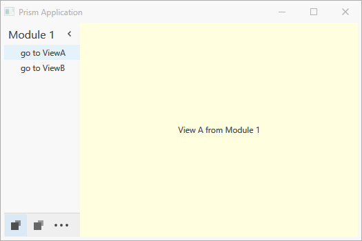

# DXPrismRegionAdapters

Demo App showing how to use the DevExpress OfficeNavigationBar with AccordinControl together with a modular Prism Setup, where the Menu is populated by the Module itself.

Credit goes to [@BrianLagunas](https://twitter.com/brianlagunas) and his Twitch Streams on Building a PrismOutlook App (you can check out the archive in this [Playlist on YT](https://www.youtube.com/playlist?list=PLf48ZHxekgCMC73VWaGnQ1YuTahCndrNW)). 
